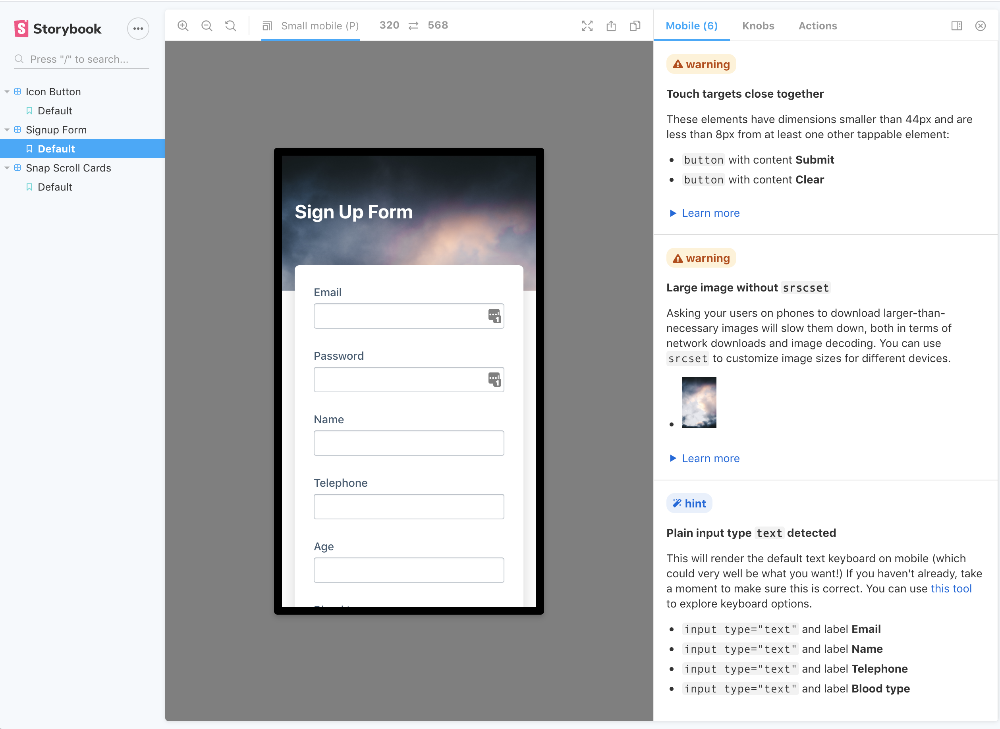

# 📱storybook-mobile

This addon offers suggestions on how you can improve the HTML, CSS and UX of your components to be more mobile-friendly.

<a href="https://storybook-mobile.netlify.app/?path=/story/signup-form--default" alt="screenshot of storybook-mobile addon">

</a>

[To see all available suggestions, check out a live storybook demo here.](https://storybook-mobile.netlify.app/?path=/story/signup-form--default)

## Quick Start

`yarn add -D storybook-mobile` or `npm install --save-dev storybook-mobile`

Next, add `storybook-mobile` to your list of addons:

`.storybook/main.js`

```diff
module.exports = {
  // other config goes here
  addons: [
+    'storybook-mobile/register'
     ],
}
```

This addon works best along with the [@storybook/addon-viewport](https://github.com/storybookjs/storybook/tree/next/addons/viewport) addon, so please install that as well if you don't have it already.

## Contributing

If you have any suggestions or find any bugs, please make an issue or a pr!
